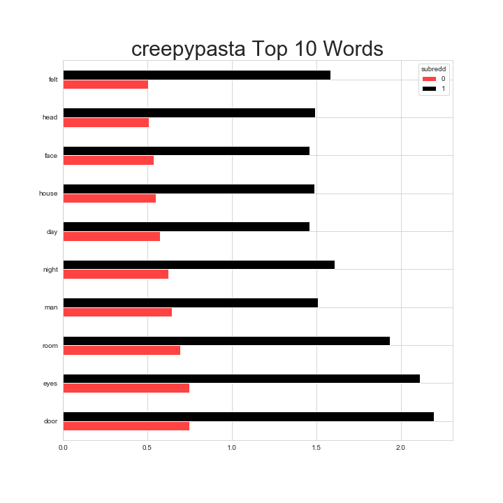
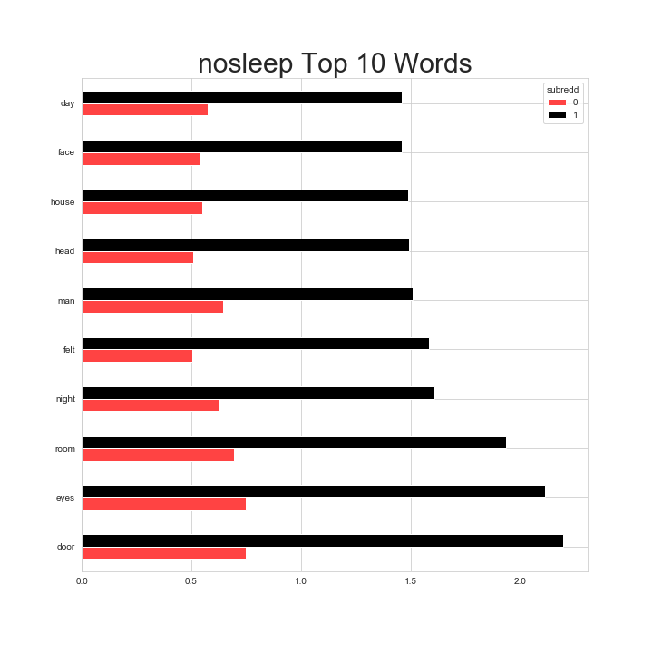
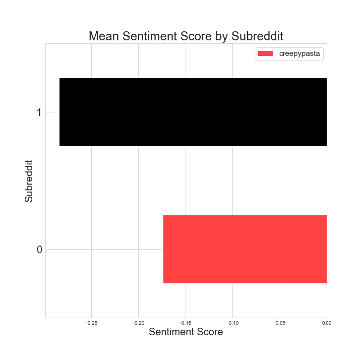
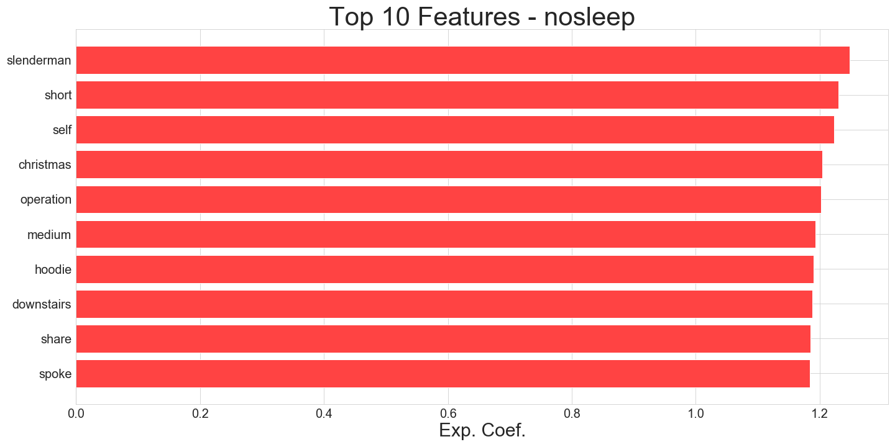

## Classifying Subreddit Posts Using NLP

### Summary
In this project, I used [Pushshift's](https://github.com/pushshift/api) API to collect posts from two subreddits: [`/r/nosleep`](https://www.reddit.com/r/nosleep) and [`/r/creepypasta`](https://www.reddit.com/r/creepypasta). Using Natural Language Processing, I trained a few classifiers to determine where the post came from. After conducting a `GridSearch()` on different parameters for each classifier, I chose the model and parameters with the best test score. By running `CountVectorizer()` and `ExtraTreesClassifier()` through a `Pipeline()`, the model was able to predict the subreddit 77% of the time.

**Selecting Two Subreddits**  
The subreddits I chose are both platforms where users can write and share horror stories. The main differences are in the number of users, where [`/r/nosleep`](https://www.reddit.com/r/nosleep) has 13.8m members and [`/r/creepypasta`](https://www.reddit.com/r/creepypasta) has 326k members, and the requirements for the stories users create and share. On [`/r/nosleep`](https://www.reddit.com/r/nosleep), users' stories are usually long and are required to have a believable
plot written in the first-person. On [`/r/creepypasta`](https://www.reddit.com/r/creepypasta), stories are usually short, may contain a video or image, and meant to be virally shared. I chose these subreddits because of their similar content, yet distinguishable styles. Although the posts from both subreddits contain many similar words, the model trains on 10,000 observations from each subreddit to then classify the post.

---
### Problem Statement
Based on the two highly visited horror subreddits, [`/r/nosleep`](https://www.reddit.com/r/nosleep) and [`/r/creepypasta`](https://www.reddit.com/r/creepypasta), a film studio wants to know:
- On average, what horror stories are more popular?
- What subreddit did they come from?

Using classification modeling, I will collect 10,000 posts from each subreddit and
determine what the most common words are from each subreddit and find the top 10 overlapping words. Given the post, the model will be able to classify which subreddit the post came from. Based on the accuracy score of the model, I will adjust the classification model and parameters for each model to find which combination is more accurate.

---

### Data Collection
Using [Pushshift's](https://github.com/pushshift/api) API I was able to request and gather 10,000 posts from the two subreddits. Since only 1,000 posts are allowed per request, I created a function automates the process by pulling 10,000 subreddits at a time. The function uses the timestamp of the oldest post to make the next request. The API request gathers the information as a `.json()`, therefore the function also creates a DataFrame for each subreddit request. Once I gathered both DataFrames, I concatenated them to make a 20,000 row DataFrame to work with. The data included many columns that are not necessary for the NLP analysis so I kept only the `title`, `selftext`, and `subreddit` columns. Since some posts have have only a title and no selftext, I created a new column, that adds the title and selftext. Lastly, I used a `pickle` to optimize storage and upload it to the Data Cleaning Notebook.

---

### Data Cleaning & EDA
Cleaning and analyzing the data was an iterative process in which, I had to continuously append words to the `stopwords` list in order for the top words from each subreddit to be more meaningful to the objective of this project. Adjusting the stopwords did not have a deep impact in the accuracy of the model, but helped give an idea about the top, more relevant horror stories users generated.

Since I combined the `title` and `selftext` columns when creating the DataFrame, the observations whose `selftext` was removed, contained an image, or contained a video appeared as missing values. I handled these missing values by creating a placeholder for them and adding a new column `all_text` that combined the `title` and `selftext` in a cleaner way than I had done before. Because of the placeholder, the missing values didn't transfer to the new column, which was the goal. Lastly, I removed the filler values and was left with a clean `all_text` column on which to use as a feature for the model.

I created two columns, `char_count` and `word_count` using a lambda function that map to each observation in `all_text` and respectively, 1) calculates the item length and 2) splits the item and calculates its length. I filtered through the DataFrame and identified observations whose `char_count` was less than 10 and dropped them from the DataFrame because there are few enough where it won't make a difference in the model.

I assigned the 0's and 1's to the target subreddits, where [`/r/creepypasta's`](https://www.reddit.com/r/creepypasta) `== 0` and [`/r/nosleep's`](https://www.reddit.com/r/nosleep) `== 1`.

By looking at character and word distributions for each subreddit, it is clear that, on average, [`/r/creepypasta's`](https://www.reddit.com/r/creepypasta) posts are shorter than [`/r/nosleep's`](https://www.reddit.com/r/nosleep)
posts. The overall mean for target 0 is `447.45` and `1274.07` for target 1.

Using regular expressions, `.re()`, I was able to remove much "noise" such as: line breaks, punctuation, subreddit mentions, consecutive letters that mimic sounds, from `all_text` to improve the model.

Employing `CountVectorizer()` and `stopwords`, I ran an initial model to count the top 10 words in each subreddit and identified the top overlapping words. As I came up with these lists, I noticed that many top words were not so meaningful so I repeated the process until I removed much of the unimportant words towards the objective of identifying popular horror stories.

- Top 10 words for [`/r/creepypasta`](https://www.reddit.com/r/creepypasta) 
- Top 10 words for [`/r/nosleep`](https://www.reddit.com/r/nosleep) 

---

### Preprocessing & Modeling

##### Baseline Model
Using `.valuecounts(normalize=True)` on the target variable, I set a baseline for the model to surpass. The baseline is `1 : 0.504647` and `0 : 0.495353`.

##### Tested Models
For all the models I tested, I ran a `Pipeline` through a `Gridsearch`.
- For the first model, I used `CountVectorizer` and `LogisticRegression` with a set of parameters and got a training score of `0.7198` and a test score of `0.7218`.
- For the second model I used `CountVectorizer` and `RandomForestClassifier` with a set of parameters and got a training score of `0.9415` and a test score of `0.7561`.
- For the third model I used `CountVectorizer` and `ExtraTreesClassifier` with a set of parameters and got a training score of `0.9462` and a test score of `0.7569`.

#### Best Model:
I used a `FeatureUnion` and multiple `Pipelines`. I employed a sentiment analysis column so that I could add it to the features. I used `StandardScaler`, `CountVectorizer`, and `ExtraTreesClassifier` with a range of parameters and ran them through a three-fold `GridSearch` and achieved a training score of `0.9958` and test score of `0.7769`. This means the model can predict the subreddit about 77% of the time.

- Mean Sentiment Score by Subreddit:

- Top 10 Features:

---

### Conclusion and Recommendations

Since the subreddit [`/r/nosleep`](https://www.reddit.com/r/nosleep) has more relevant observations – given its higher average length and the fact that it contains no images – its most important features are stronger indicators of the popular horror stories generated and shared among users. The top feature indicates that as there is a one word increase in the word "slenderman," the reddit post is 1.25 times as likely to be from the [`/r/nosleep`](https://www.reddit.com/r/nosleep) subreddit. Based on the most important feature, I would recommend making a horror film based on the "Slender Man" legend.

The overlapping list of top words offers more ideas for a horror film. In both subreddits, users highly mentioned the words: `['door', 'eyes', 'room', 'man','night', 'day', 'house', 'face', 'head', 'felt', 'people', 'heard', 'thing', 'look', 'little', 'told', 'left']`, which can be important for setting a tone for the different scenes in a movie. The top features list also includes the word `'christmas'`, which highlights a time frame that users popularly share in their accounts of horror.

While processing the stories from the posts, content in the form of videos or images were overlooked, therefore there is value in further investigating those observations. Users highly engage in media content within these subreddits so gathering popular themes from that media could be an idea for another project.
